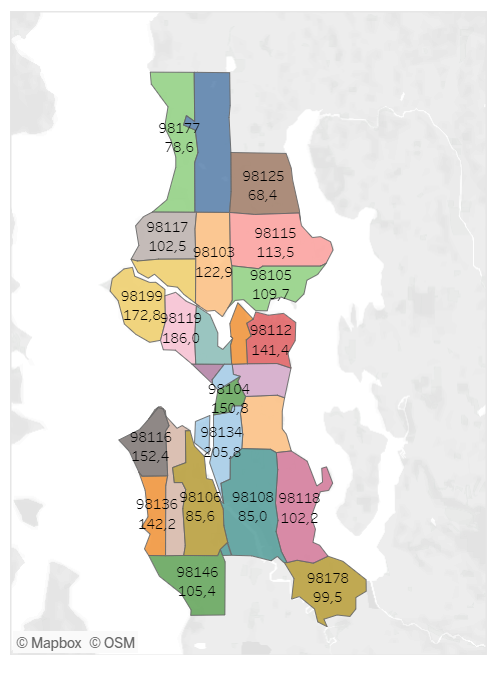

# Airbnb Data Analysis Dashboard

This project is a Tableau dashboard that visualizes Airbnb data, sourced from [Inside Airbnb](https://insideairbnb.com/get-the-data/). The dashboard helps analyze various aspects of Airbnb listings, such as pricing, bedroom distribution, revenue trends, and location-based pricing.

## Visualizations

### 1. Average Pricing per Bedroom
This bar chart shows the average price for Airbnb listings based on the number of bedrooms.

### 2. Average Price per Zip Code
This colorful bar chart displays the average price across different zip codes, helping to compare pricing by location.

### 3. Price Map by Zip Code
A map that represents average pricing by zip code with different colors, providing a geographical view of pricing differences.

### 4. Revenue Trends Over Time
This line chart shows weekly revenue trends, offering insight into seasonal fluctuations in Airbnb revenue.

### 5. Bedroom Distribution
This chart shows how many listings are available for one, two, three, and up to six bedrooms.

